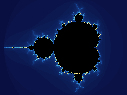
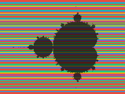

# The Mandelbrot demo: watching the swarm work

`tools/mandelbrot_demo.py` is the wasp showcase — the whole stack in
one command: discovery finds the nodes, a 1.1 KiB wasm module is pushed
to every one of them, and the swarm renders a Mandelbrot image into the
coordinator's RAM while you watch it appear live in the terminal, tile
by tile.

```sh
tools/build_test_module.sh
python3 tools/mandelbrot_demo.py discover
```





The second image is the interesting one: **each tile is colored by the
node that rendered it** (red = the Nucleo, the rest = Pico Ws). Nobody
assigned those tiles — the interleaving is the work-stealing loop made
visible, and the Nucleo's wider share is simply a 180 MHz M4F on
Ethernet outrunning 133 MHz M0+ boards on WiFi.

## How it works

There is no scheduler and no per-node assignment anywhere:

- The coordinator registers three regions: the **job parameters**
  (seven i32s: size, tile height, max iterations, and the Q4.28
  fixed-point viewport), a **work counter**, and the **framebuffer**
  (one iteration-count byte per pixel). Then it calls `render` once on
  every node and just serves memory.
- Each node loops: claim the next tile with one atomic
  `wasp_add(counter)` RPC, render it locally, ship it with one bulk
  `wasp_mem_write`. Two round-trips per tile, everything else is
  compute — the regime the [performance guide](performance.md) says
  the swarm should live in.
- The coordinator never asks who rendered what: it observes the
  `MEM_WRITE` offsets arriving (a ~15-line `WaspNode` subclass) and
  gets tile completion *and* provenance for free.

All math is Q4.28 fixed point — the Pico W has no FPU, and integer
math keeps WAMR's interpreter fast and the i32-only calling convention
happy. `--center`/`--span` zoom anywhere the 28 fractional bits reach:

```sh
python3 tools/mandelbrot_demo.py discover \
    --size 320x240 --iter 200 --center -0.7453 0.1127 --span 0.014
```


## Numbers (6-node fleet, 2026-07-15)

| view | size | time | tiles: Nucleo / each Pico |
| --- | --- | ---: | --- |
| full set, 96 iter | 256×192 | 4.0 s | 34 / 11–13 (of 96) |
| seahorse valley, 200 iter | 320×240 | 18.0 s | 32 / 17–18 (of 120) |

The tile split is the self-balancing in action: on the shallow view
the Nucleo takes ~35% of the image; on the deeper, compute-heavier
view the WiFi latency matters less and the split tightens.

## Recording it

`--gif` additionally writes `NAME.gif` — the framebuffer captured
every 250 ms and replayed in real time (looping), like the animation
above. It's a pure-stdlib GIF89a encoder: the framebuffer's iteration
bytes double as palette indices, so recording costs one buffer copy
per snapshot and everything is assembled after the render finishes.

```sh
python3 tools/mandelbrot_demo.py discover --gif
```

## Kill a node mid-render

The demo's party trick, and the reason a coordinator needs to be more
than a memory server. Run with `--chaos` (or physically unplug a Pico
mid-render):

```
--chaos: killing 10.0.0.189's connection
...
re-issuing 1 lost tile(s) to 5 surviving node(s)
...
10.0.0.189      rpi_pico/rp2040/w    3 tiles ( 3.1%)  [died mid-render]
```

What happens under the hood: the dead node's in-flight RPC fails, its
module traps, and the node recovers on its own (~5 s) — meanwhile the
survivors keep claiming tiles as if nothing happened, because the work
counter never belonged to any node. At the end the coordinator diffs
"tiles claimed" against "tiles that actually arrived" and re-issues
the difference via `render_tile`. The image always completes.

## Why this is the coordinator prototype

The demo forces exactly the organs the future coordinator needs, and
implements each in miniature: fleet assembly from ANNOUNCE discovery,
module distribution, a work queue (one shared atomic counter), result
assembly (regions + write observation), and failure detection with
work re-issue. When the real (C) coordinator happens, this script is
its executable spec — and since the job parameters follow the
[shared-struct contract](performance.md#sharing-structs-with-a-c-coordinator),
`mandelbrot_module.wasm` will run against it unchanged.
