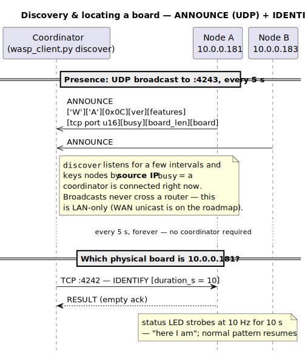
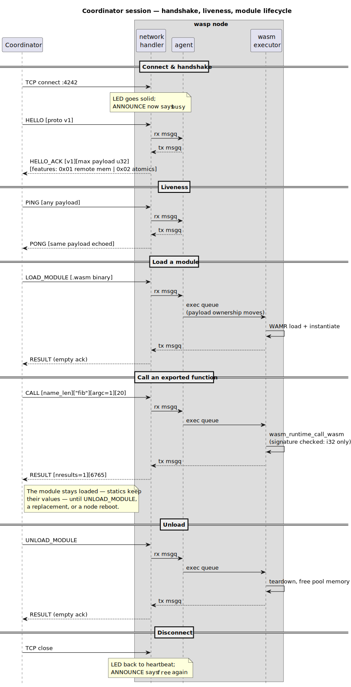
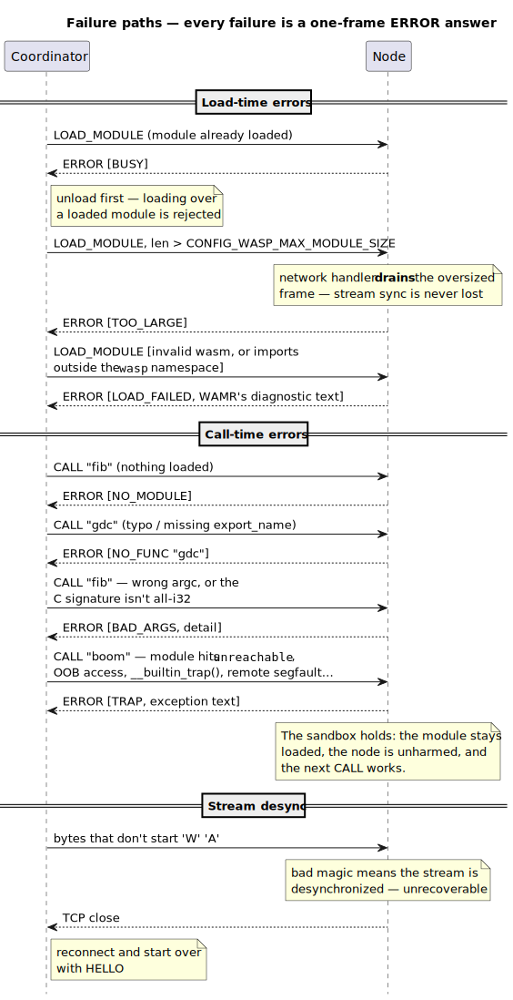
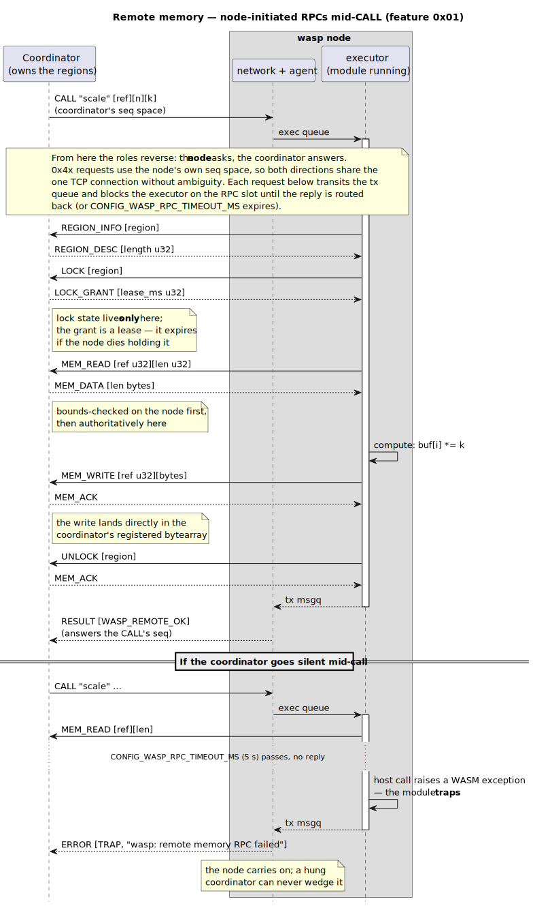
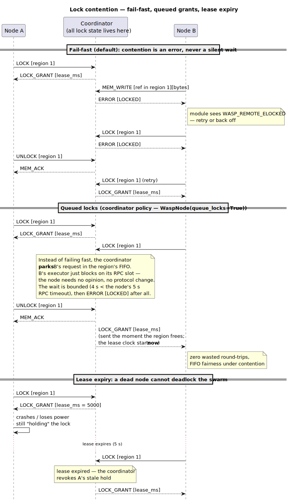
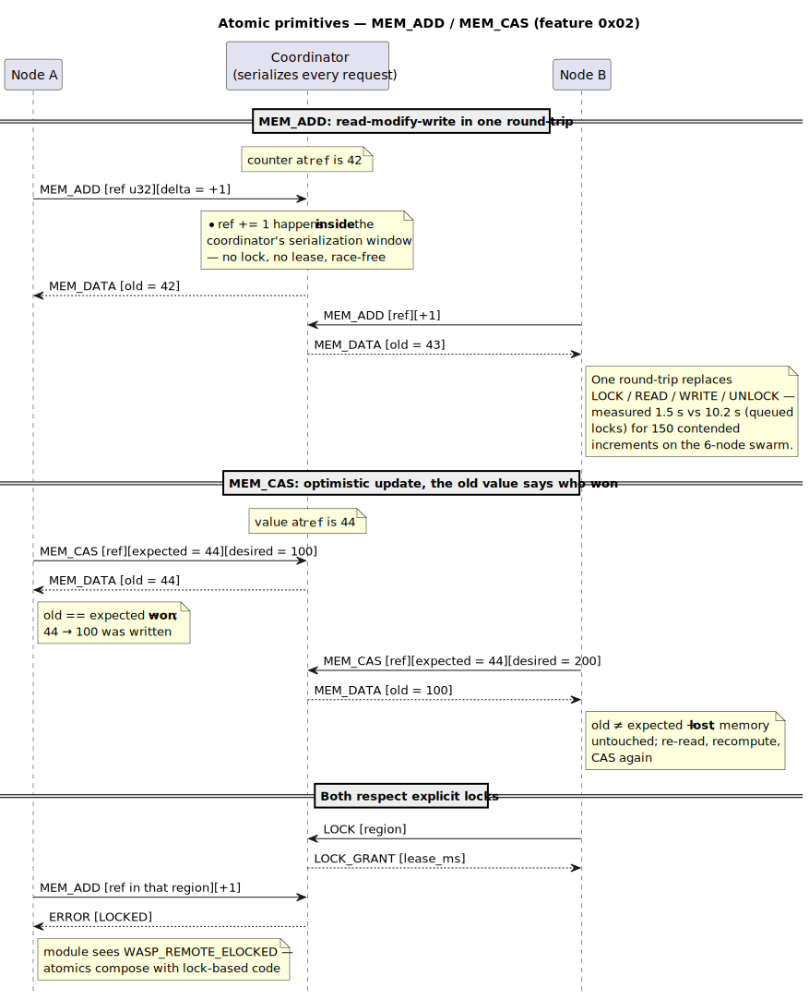
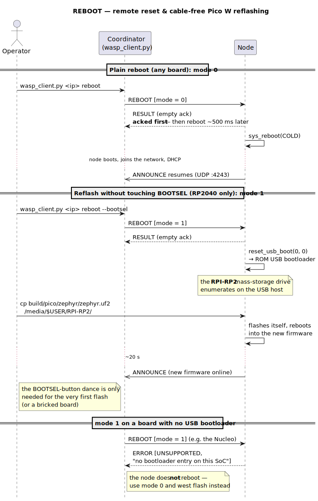

# Protocol sequence diagrams

Every message type in `app/src/protocol.h` appears in at least one
scenario below. Sources are the `.puml` files in this directory; the
checked-in `.svg` files are rendered from them. To regenerate after
editing (needs Java, no install):

```sh
curl -sLo /tmp/plantuml.jar \
  https://github.com/plantuml/plantuml/releases/download/v1.2024.7/plantuml-1.2024.7.jar
java -jar /tmp/plantuml.jar -tsvg docs/diagrams/*.puml
```

## Discovery & locating a board

`ANNOUNCE` (UDP broadcast), `IDENTIFY`.



## Coordinator session

Connect, `HELLO`/`HELLO_ACK`, `PING`/`PONG`, `LOAD_MODULE`, `CALL`,
`RESULT`, `UNLOAD_MODULE` — including how frames route through the
node's three threads.



## Failure paths

`ERROR` in all its flavors: `BUSY`, `TOO_LARGE`, `LOAD_FAILED`,
`NO_MODULE`, `NO_FUNC`, `BAD_ARGS`, `TRAP`, and the bad-magic
disconnect.



## Remote memory (mid-`CALL` role reversal)

`REGION_INFO`/`REGION_DESC`, `LOCK`/`LOCK_GRANT`, `MEM_READ`/`MEM_DATA`,
`MEM_WRITE`/`MEM_ACK`, `UNLOCK` — plus the silent-coordinator timeout
that traps the module.



## Lock contention

Fail-fast `ERROR(LOCKED)`, coordinator-side queued grants, and lease
expiry when a node dies holding a lock.



## Atomic primitives

`MEM_ADD`, `MEM_CAS` (win and lose), and how both respect explicit
locks.



## Reboot & cable-free reflashing

`REBOOT` mode 0 (any board), mode 1 (RP2040 USB-bootloader entry →
copy the uf2), and `ERROR(UNSUPPORTED)` on boards without a bootloader
entry.


